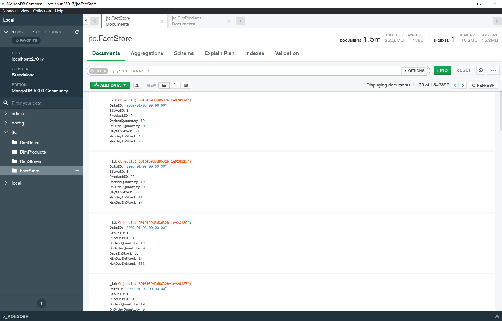
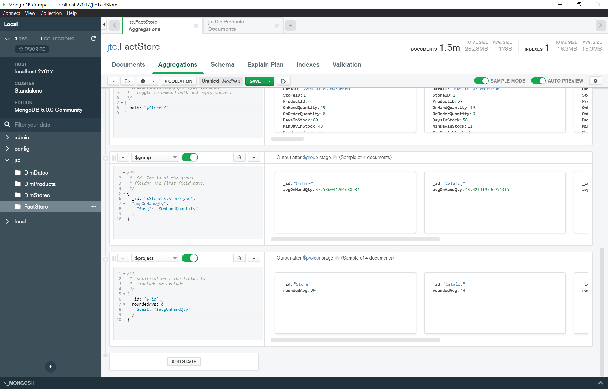

# JTC Technical Assigment

## Task 1 - Rest API

[Task 1 - Rest API](Task 1 - Rest API.ipynb)

Task was performed using python on Jupyter Notebook. 
Used the request.get() method to send request to base url, and then based on the API defintion, write functions for the various operations:
- GetAllUsers
- GetUser(by name)
- DeleteUser(by user_id)
- AddUpdateUser

## Task 2 - Batch process orchestration

[Task 2 - Batch process orchestration](Task 2 - Batch process orchestration.ipynb)

Task was performed using python on Jupyter Notebook by using pymongo to connect to MongoDBclient.

1. Extract the raw data(2009.zip) file
2. The DDL and DML commands are in SQL so we need to execute and the export the data to sql dumps (The folder has dumps in it)
3. Create mongo cluster to save the data
4. Run the script step by step
    - It will load the dumps to the DB
    - It will generate pipe-delimited load files in the path (/dataextract/yy/MM/dd/factstore.txt) 
    - It will load the factstore data to the mongo Db
    

Aggregation query in MongoDB operation exceeded timeout limit. Only able to successfully aggregate if limit number of documents.

###################################################

Testing using Query

Query average number of stocks on hand by category
---------------------------------------------------
jtc.FactStore.aggregate(
[{
    $lookup: {
        from: 'DimProducts',
        localField: 'ProductID',
        foreignField: 'ProductID',
        as: 'ProductLK'
    }
}, {
    $unwind: {
        path: "$ProductLK"
    }
}, {
    $group: {
        _id: "$ProductLK.ProductCategoryName",
        "avgOnHandQty": {
            "$avg": "$OnHandQuantity"
        }
    }
}, {
    $project: {
        _id: '$_id',
        roundedAvg: {
            $ceil: '$avgOnHandQty'
        }
    }
}]
)

###################################################

Query average number of stocks on hand by store
---------------------------------------------------

jtc.FactStore.aggregate(
[{
    $lookup: {
        from: 'DimStores',
        localField: 'StoreID',
        foreignField: 'StoreID',
        as: 'StoreLK'
    }
}, {
    $unwind: {
        path: "$StoreLK"
    }
}, {
    $group: {
        _id: "$StoreLK.StoreType",
        "avgOnHandQty": {
            "$avg": "$OnHandQuantity"
        }
    }
}, {
    $project: {
        _id: '$_id',
        roundedAvg: {
            $ceil: '$avgOnHandQty'
        }
    }
}]
)

###################################################

